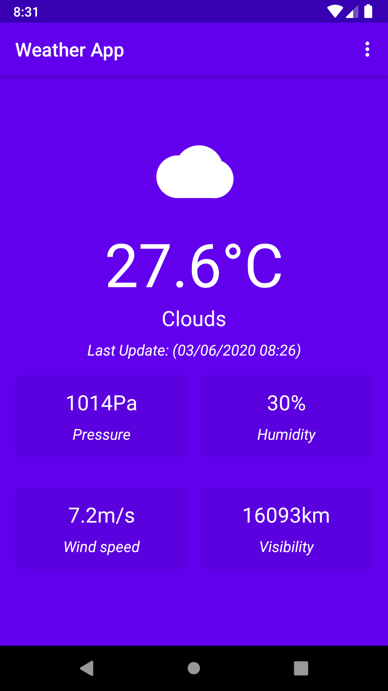

# Weather App (#30DaysOfKotlin)
Weather Application developed in Kotlin Programming Language to use of check the user's current location weather status.

## Sreenshots
| |

# Features
- Android KTX
- Nullable data types
- ViewModel
- LiveData
- Data binding
- Fetch current location
- Networking with [Retrofit](https://square.github.io/retrofit/)
